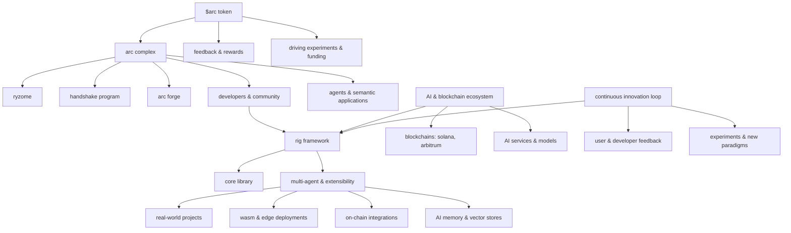

# /architecture

discover the core components of our ecosystem and how they work together to power innovative AI applications and semantic software. dive into the details of each module to explore its purpose, functionality, and integration within the arc framework.

## the ecosystem at a glance

## modules

| module | doc | one-liner |
|---|---|---|
| rig framework | [modules/rig-framework.md](modules/rig-framework.md) | the foundational rust-based system for building and orchestrating AI agents |
| arc complex | [modules/arc-complex.md](modules/arc-complex.md) | a cyborg collective of developers and AI agents building on rig |
| ryzome | [modules/ryzome.md](modules/ryzome.md) | your second brain, now with intelligence — an infinite AI canvas |
| handshake program | [modules/handshake-program.md](modules/handshake-program.md) | an open call to propose and build with rig |
| arc forge | [modules/arc-forge.md](modules/arc-forge.md) | token launch platform on meteora dlmm with jupiter routing |
| $arc token | [modules/arc-token.md](modules/arc-token.md) | fair-launched token aligning incentives across the ecosystem |
| AI & blockchain ecosystem | [modules/ai-blockchain-ecosystem.md](modules/ai-blockchain-ecosystem.md) | the broader environment extending rig's capabilities |
| continuous innovation loop | [modules/continuous-innovation-loop.md](modules/continuous-innovation-loop.md) | the cyclical engine of experiments and community enhancements |

## more

- [model-providers.md](model-providers.md) — the LLM providers the framework connects to
- [data/architecture.json](data/architecture.json) — the full module tree, machine-readable
- [`$arch token`](%24arch%20token) — the $ARCH token doc (mint + market link TBD)
- [index.html](index.html) — the interactive one-page version of this architecture

## ready to dive deeper?

join our handshake program to collaborate, build AI use cases, or explore more about our ecosystem.
