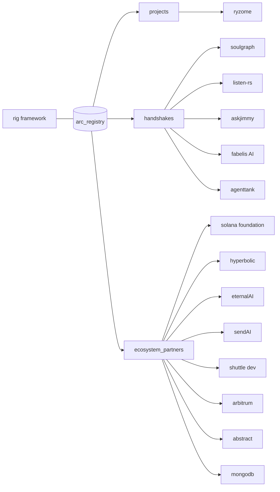

# arc_registry

**total handshakes: 6**

the arc registry tracks three types of relationships:

| type | meaning |
|---|---|
| **projects** | all things built with rig, arc's agent & llm framework |
| **handshakes** | projects & teams that successfully completed the arc handshake vetting process |
| **ecosystem_partners** | organizations and infrastructure providers supporting builders in the arc handshake program ecosystem |

## the registry at a glance



## projects & handshakes

| entry | status | tags | doc |
|---|---|---|---|
| ryzome | no_token | AI_layer | [projects/ryzome.md](projects/ryzome.md) |
| soulgraph | token_live | AI_layer · creative · handshake | [projects/soulgraph.md](projects/soulgraph.md) |
| listen-rs | token_live | AI_layer · onchain · defi · handshake | [projects/listen-rs.md](projects/listen-rs.md) |
| askjimmy | token_live | AI_layer · onchain · defi · handshake · forge | [projects/askjimmy.md](projects/askjimmy.md) |
| fabelis AI | token_live | AI_layer · onchain · handshake | [projects/fabelis-ai.md](projects/fabelis-ai.md) |
| agenttank | token_live | AI_layer · creative · onchain · handshake | [projects/agenttank.md](projects/agenttank.md) |

## ecosystem partners

| partner | kind | doc |
|---|---|---|
| solana foundation | grant | [partners/solana-foundation.md](partners/solana-foundation.md) |
| hyperbolic | tech | [partners/hyperbolic.md](partners/hyperbolic.md) |
| eternalAI | tech | [partners/eternalai.md](partners/eternalai.md) |
| sendAI | tech | [partners/sendai.md](partners/sendai.md) |
| shuttle dev | tech | [partners/shuttle-dev.md](partners/shuttle-dev.md) |
| arbitrum | grant | [partners/arbitrum.md](partners/arbitrum.md) |
| abstract | grant | [partners/abstract.md](partners/abstract.md) |
| mongodb | tech | [partners/mongodb.md](partners/mongodb.md) |

## filter taxonomy

`all projects` · `ai_layer` · `creative` · `onchain` · `defi` · `microcontrollers` · `handshake` · `forge` · `ecosystem_partner`

## the toolkit

`data/registry.json` is the single source of truth. three consumers ship in this repo, each with its own test gate (all wired into [CI](.github/workflows/ci.yml)):

**rust cli** — typed models ([src/lib.rs](src/lib.rs)) + a query tool:

```sh
cargo run -- stats                 # entry counts + tag histogram
cargo run -- list --tag defi       # filter by tag or --type
cargo run -- show askjimmy         # one entry, full detail
cargo run -- validate              # structural invariants
cargo test                         # 7 integration tests
```

**js sdk** — zero-dependency ESM, same API surface for Node and the browser:

```js
import { loadRegistry, byTag, tagCounts } from "./sdk/js/registry.mjs";
const reg = await loadRegistry("data/registry.json");
byTag(reg, "forge");               // → [askjimmy]
```

```sh
node --test sdk/js/registry.test.mjs   # 6 tests
```

**python validator** — JSON-Schema subset + structural rules, the CI gate:

```sh
python3 tools/validate_registry.py
# ok — 14 entries (6 handshakes, 8 partners, 0 plain projects); 5 live tokens
```

the invariants all three enforce are written down in [registry-spec.md](registry-spec.md); how to add an entry is in [CONTRIBUTING.md](CONTRIBUTING.md).

## more

- [data/registry.json](data/registry.json) — the full registry, machine-readable · [schema](data/registry.schema.json)
- [registry-spec.md](registry-spec.md) — the data contract, including the type-vs-tag semantics
- [CONTRIBUTING.md](CONTRIBUTING.md) — how entries get added and gated
- [`$registry token`](%24registry%20token) — the $REGISTRY token doc (mint + market link TBD)
- [index.html](index.html) — the interactive registry page

coming soon — stay tuned for upcoming handshakes & partners.
