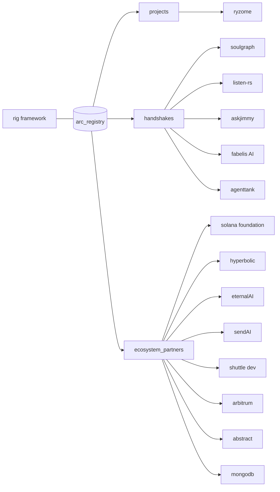

# arc_registry

**total handshakes: 6**

the arc registry tracks three types of relationships:

| type | meaning |
|---|---|
| **projects** | all things built with rig, arc's agent & llm framework |
| **handshakes** | projects & teams that successfully completed the arc handshake vetting process |
| **ecosystem_partners** | organizations and infrastructure providers supporting builders in the arc handshake program ecosystem |

## the registry at a glance

## projects & handshakes

| entry | status | tags | doc |
|---|---|---|---|
| ryzome | no_token | AI_layer | [projects/ryzome.md](projects/ryzome.md) |
| soulgraph | token_live | AI_layer · creative · handshake | [projects/soulgraph.md](projects/soulgraph.md) |
| listen-rs | token_live | AI_layer · onchain · defi · handshake | [projects/listen-rs.md](projects/listen-rs.md) |
| askjimmy | token_live | AI_layer · onchain · defi · handshake · forge | [projects/askjimmy.md](projects/askjimmy.md) |
| fabelis AI | token_live | AI_layer · onchain · handshake | [projects/fabelis-ai.md](projects/fabelis-ai.md) |
| agenttank | token_live | AI_layer · creative · onchain · handshake | [projects/agenttank.md](projects/agenttank.md) |

## ecosystem partners

| partner | kind | doc |
|---|---|---|
| solana foundation | grant | [partners/solana-foundation.md](partners/solana-foundation.md) |
| hyperbolic | tech | [partners/hyperbolic.md](partners/hyperbolic.md) |
| eternalAI | tech | [partners/eternalai.md](partners/eternalai.md) |
| sendAI | tech | [partners/sendai.md](partners/sendai.md) |
| shuttle dev | tech | [partners/shuttle-dev.md](partners/shuttle-dev.md) |
| arbitrum | grant | [partners/arbitrum.md](partners/arbitrum.md) |
| abstract | grant | [partners/abstract.md](partners/abstract.md) |
| mongodb | tech | [partners/mongodb.md](partners/mongodb.md) |

## filter taxonomy

`all projects` · `ai_layer` · `creative` · `onchain` · `defi` · `microcontrollers` · `handshake` · `forge` · `ecosystem_partner`

## more

- [data/registry.json](data/registry.json) — the full registry, machine-readable
- [`$registry token`](%24registry%20token) — the $REGISTRY token doc (mint + market link TBD)
- [index.html](index.html) — the interactive registry page

coming soon — stay tuned for upcoming handshakes & partners.
